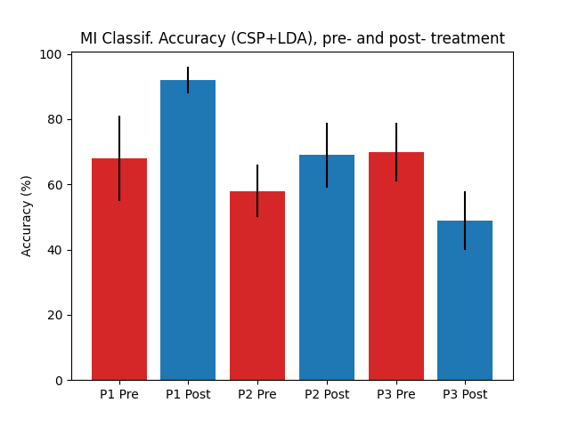
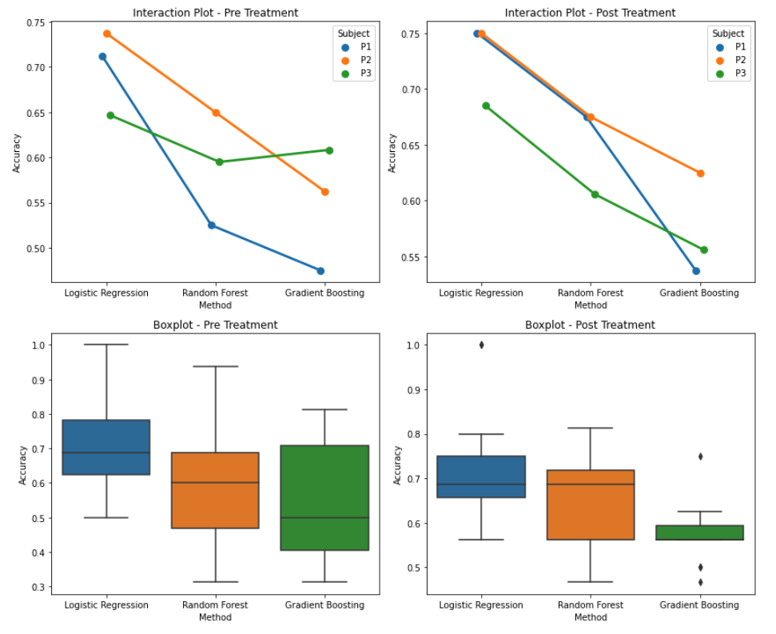

# gtec BCI & Neurotechnology Spring School 2024 | Hackathon | Team NeuroSparks

In this [hackathon](https://www.br41n.io/), we had 24 hours to build something 
cool with [gtec](https://www.gtec.at/)'s technology. 

We hopped on the Stroke Rehabilitation Data Analysis project. We were given an
EEG dataset to play with and two relevant papers.

- Brain Computer Interface treatment for motor rehabilitation of upper extremity
of stroke patients – A feasibility study ([link](https://pubmed.ncbi.nlm.nih.gov/33192277/))
- Time-Variant Linear Discriminant Analysis Improves Hand Gesture and Finger Movement Decoding
for Invasive Brain-Computer Interfaces ([link](https://www.frontiersin.org/articles/10.3389/fnins.2019.00901/full))

The story behind these two papers is as follows.

Researchers are interested in promoting the rehabilitation of stroke patients
experiencing acute motor impairment. To this end, we can ask patients
to imagine moving their limb; and, when successful, view inside virtual reality 
(VR) the corresponding movement. At the same time, we can deliver functional
electrical stimulation (FES) to their corresponding muscle.

The combination of VR and FES seems to promote stroke patient recovery,
alleviating their motor impairment.

Brain-computer interface (BCI) technology fits in here, by allowing us to decode
the patient's brain activity, recorded with
EEG or ECoG, during imagined movement. If they have
correctly imagined moving their limb, a VR and FES integrated system can 
reward the patient accordingly.

The first paper showed that this paradigm was feasible. The second paper
improved on the signal processing methods used by the BCI for detecting
imagined movement. Performance in these signal processing methods is understood
with three criteria; accuracy, processing time and generalisability.

## Our Project

We used the hackathon as a learning opportunity. We replicated some of the
signal processing methods in the first paper. These methods involved
linear transformations. They are Common Spatial Patterns (CSP) for feature 
extraction, and Linear Discriminant Analysis (LDA) for classifiation.

Interested in comparing the paper's linear signal processing to non-linear
methods, we also implemented Random Forest, Logistic Regression and Gradient
Boosting.

Lastly, we found an old repository
[StrokeNet](https://github.com/hWils/Stroke-Net) from this hackathon a few
years ago. They implemented some deep learning architectures; this was useful
to compare our performances to theirs.

## Discussion

Our analysis confirms that linear transformation methods are far superior
in processing time than non-linear machine learning models. This makes linear
transformations far more applicable in the BCI-rehabilitation paradigm; even
though accuracy can be improved by some non-linear models.

Interestingly, while replicating CSP, we tuned this feature extraction method's
hyper parameters, and found that some subjects had improved accuracy with
greater than four components. The original paper reported that
four components were used in all subjects. We propose that subject-specific
hyper parameter tuning could improve motor imagery detection performance,
inside the BCI-rehabilitation paradigm.

Our replication of CSP+LDA showed promising performance in accuracy as
pictured, though not as high the original paper. See limitations below.

Our logistic regression, random forest, and gradient boosting implementations achieved moderate accuracy, with logistic regression performing the best. However, each method took over 20 minutes to run on our machines. In contrast, CSP+LDA completed in just a few seconds.

Our comparison of our implementations to 
[StrokeNet](https://github.com/hWils/Stroke-Net) similarly indicated that
accuracy of non-linear ML can outperform linear transformations; but not
processing time.

### Limitations

If, like us, you're interested in learning EEG signal processing from this 
paper/dataset, this repository is a good starting point. There are plenty
of places to improve our implementation, indicated below.

#### CSP + LDA

Our pre-processing and stimulus artefact removal was limited to bandpass
filtering between 8 and 30 Hz. 

More specific frequency band analysis, and better stimulus artefact removal
could be added to match accuracy performance described in the paper.

It's possible as well, in this time frame, that steps in CSP feature extraction
and LDA classification were missed. Comments explain what was done throughout,
and may identify discrepancies with the paper or with better methods out there.

#### LogReg + RF + GB

Being short on time, preprocessing/feature extraction were altogether skipped, 
with raw EEG data being used for these ML methods.

## How to Interact With This Repo 

Keep in mind we only had 24 hours :p so this repository is
a little messy. 

If you're working at gtec's next hackathon
on this dataset you can start with our Jupyter notebook
`experiment.ipynb` for data visualisation. 

The `experiment.ipynb` notebook also includes 
our final csp+lda implementation, but these were copied to other scripts towards
the end of the hack for ease of use.

The Traditional_ML_rawEEG_LR_Classification.ipynb notebook contains code for traditional machine learning algorithms and cross-validation implementation, with results displayed in the classical_ML_results folder. Additionally, it includes statistical analysis on the impact of ML methods, treatment stage (Pre/Post), and individual differences, accompanied by visualization plots.

Our simple pre-processing method is inside `preprocess.m` (missing on init).

Our entire CSP + LDA signal processing pipeline is inside. 
`csp_lda.py`.

`jobs.sh` indicates how we used the above scripts on each participant.

### Data

Data from three participants in this 
[study](https://pubmed.ncbi.nlm.nih.gov/33192277/) was provided by gtec. 
You may contact authors for access.

Place raw data inside `data/stroke`. Filtered data should go to `data/filtered`
after running `preprocess.m`.

## Team

- Ozgur Ege Aydogan
- Reehab Ahmed
- Christina Yunjie
- Fadzai Saravoyi
- Preethom Pal
- Dr. Rishabh Pathak
- Aaisha Sheth
